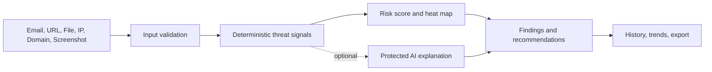

<div align="center">
  

  <h1>EchoMe</h1>
  <p><strong>AI-powered phishing detection and cybersecurity analysis in your browser.</strong></p>

  <p>
    <a href="https://shii9.github.io/EchoMe/">View Live Application</a> ·
    <a href="https://github.com/shii9/EchoMe/issues">Report an Issue</a> ·
    <a href="SECURITY.md">Security Policy</a>
  </p>

  <p>
    
    
    
    
  </p>
</div>

EchoMe turns suspicious emails, URLs, domains, IP addresses, files, and screenshots into clear, explainable security assessments. It combines deterministic threat signals with optional protected AI assistance, risk heat maps, recommendations, and learning tools.

## 📑 Table of Contents

- [About the Project](#-about-the-project)
- [Key Features](#-key-features)
- [How It Works](#-how-it-works)
- [Technology Stack](#-technology-stack)
- [Security & Privacy](#-security--privacy)
- [Run Locally](#-run-locally)
- [Deployment](#-deployment)
- [Disclaimer](#-disclaimer)

## 🔍 About the Project

Phishing messages often combine urgency, impersonation, suspicious links, and requests for sensitive information. EchoMe checks these signals consistently and presents the result as a practical risk assessment instead of a simple yes/no answer.

The application is built for security awareness, education, and personal safety checks. It is not a replacement for professional incident response, malware analysis, or reputation services.

## 🚀 Key Features

- **Email analysis:** Detect urgency, impersonation, suspicious links, credential requests, and header anomalies.
- **Multi-input detection:** Analyze URLs, domains, IP addresses, files, screenshots, and raw email headers.
- **Threat heat maps:** See which signals influence low, medium, high, or critical risk.
- **Authentication checks:** Inspect SPF, DKIM, and DMARC results when headers are available.
- **Actionable guidance:** Get explanations and safer next steps for each finding.
- **History and insights:** Review previous analyses with statistics, trends, exports, and sharing tools.
- **Learning tools:** Practice with quizzes, achievements, and educational security content.
- **Professional interface:** Responsive dark/light themes with consistent navigation and accessible feedback.

## 🧭 How It Works



## 💻 Technology Stack

| Layer | Technology |
| --- | --- |
| UI | React 18, TypeScript, Tailwind CSS, Radix UI |
| Build | Vite 8 |
| Navigation | React Router |
| Motion & icons | Framer Motion, Lucide React |
| Optional AI | Supabase Edge Functions |
| Hosting | GitHub Pages via GitHub Actions |

## 🛡️ Security & Privacy

- Analysis history and preferences are stored locally in the browser.
- API keys are not persisted by the client.
- The client no longer exposes admin/blog administration credentials.
- The optional AI Edge Function validates payload size, message roles, CORS origins, and request rate.
- Provider secrets belong in server-side environment variables, never in `VITE_*` variables.
- Read [SECURITY.md](SECURITY.md) before enabling production integrations.

## 🧰 Run Locally

Requirements: Node.js 20.19.0 or newer.

```bash
npm ci
npm run dev
```

The development server runs at `http://localhost:8080`.

Useful checks:

```bash
npm run test:phishing
npx tsc --noEmit
npm run build
```

## 🌐 Deployment

The repository includes a GitHub Actions workflow at `.github/workflows/deploy-pages.yml`. It verifies the application, builds the production bundle, and publishes the `gh-pages` branch.

The live application is available at [shii9.github.io/EchoMe](https://shii9.github.io/EchoMe/). For repository setup, open **Settings → Pages**, choose **Deploy from a branch**, and select `gh-pages` with `/ (root)`.

Manual deployment is also available:

```bash
npm run deploy
```

## ⚖️ Disclaimer

EchoMe is intended for authorized security awareness, education, and defensive analysis. Do not use it to access, test, or investigate systems without permission. Users are responsible for complying with applicable laws, policies, and terms of service.

## 📄 License

See the repository for licensing information.

<div align="center">
  <sub>Built for clearer, safer security decisions.</sub>
</div>
