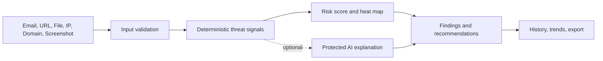

<div align="center">
  

  <h1>EchoMe</h1>
  <p><strong>AI-powered phishing detection and cybersecurity analysis in your browser.</strong></p>

  <p>
    <a href="https://shii9.github.io/EchoMe/">View Live Application</a> ·
    <a href="https://github.com/shii9/EchoMe/issues">Report an Issue</a> ·
    <a href="SECURITY.md">Security Policy</a>
  </p>

  <p>
    
    
    
    
  </p>
</div>

EchoMe turns suspicious emails, URLs, domains, IP addresses, files, and screenshots into clear, explainable security assessments. It combines deterministic threat signals with optional protected AI assistance, risk heat maps, recommendations, and learning tools.

## Table of Contents

- [About the Project](#about-the-project)
- [Key Features](#key-features)
- [Supported Analysis](#supported-analysis)
- [How It Works](#how-it-works)
- [Risk Interpretation](#risk-interpretation)
- [Technology Stack](#technology-stack)
- [Security and Privacy](#security-and-privacy)
- [Project Structure](#project-structure)
- [Disclaimer](#disclaimer)

## About the Project

Phishing messages often combine urgency, impersonation, suspicious links, and requests for sensitive information. EchoMe checks these signals consistently and presents the result as a practical risk assessment instead of a simple yes/no answer.

The application is built for security awareness, education, and personal safety checks. It is not a replacement for professional incident response, malware analysis, or reputation services.

## Key Features

- **Email analysis:** Detect urgency, impersonation, suspicious links, credential requests, and header anomalies.
- **Multi-input detection:** Analyze URLs, domains, IP addresses, files, screenshots, and raw email headers.
- **Threat heat maps:** See which signals influence low, medium, high, or critical risk.
- **Authentication checks:** Inspect SPF, DKIM, and DMARC results when headers are available.
- **Actionable guidance:** Get explanations and safer next steps for each finding.
- **History and insights:** Review previous analyses with statistics, trends, exports, and sharing tools.
- **Learning tools:** Practice with quizzes, achievements, and educational security content.
- **Professional interface:** Responsive dark/light themes with consistent navigation and accessible feedback.

## Supported Analysis

| Input | What EchoMe checks |
| --- | --- |
| Email | Message language, sender signals, links, requests, impersonation, and headers |
| URL | Scheme, host, redirects, suspicious patterns, encoding, and brand indicators |
| Domain | Domain structure, reputation signals, age/context indicators, and risk patterns |
| IP address | Address format, network context, reputation indicators, and suspicious ranges |
| File | Name, extension, type, size, metadata, and potentially risky characteristics |
| Screenshot | Visible text, links, warnings, branding, and social-engineering signals |

## How It Works



## Risk Interpretation

| Level | Meaning | Recommended action |
| --- | --- | --- |
| Low | Few suspicious indicators were found | Continue carefully and verify the source |
| Medium | Some indicators require additional context | Verify independently before interacting |
| High | Multiple phishing or deception signals are present | Do not click, reply, download, or share information |
| Critical | Strong evidence of a malicious or impersonating attempt | Stop interaction and report or isolate the content |

Scores are guidance, not proof. A low score does not guarantee safety, and a high score should be reviewed with the original context.

## Technology Stack

| Layer | Technology |
| --- | --- |
| UI | React 18, TypeScript, Tailwind CSS, Radix UI |
| Build | Vite 8 |
| Navigation | React Router |
| Motion and icons | Framer Motion, Lucide React |
| Optional AI | Supabase Edge Functions |
| Hosting | GitHub Pages via GitHub Actions |

## Security and Privacy

- Analysis history and preferences are stored locally in the browser.
- API keys are not persisted by the client.
- The client no longer exposes admin/blog administration credentials.
- The optional AI Edge Function validates payload size, message roles, CORS origins, and request rate.
- Provider secrets belong in server-side environment variables, never in `VITE_*` variables.
- Read [SECURITY.md](SECURITY.md) before enabling production integrations.

## Project Structure

```text
src/
├── components/       Reusable interface and analysis components
├── data/              Examples, quiz content, and static reference data
├── pages/             Detector, statistics, trends, assessment, and blog views
├── utils/             Scoring, history, exports, and achievement logic
└── integrations/     Optional Supabase client and generated types
public/                PWA assets, service worker, and EchoMe branding
scripts/               Local regression checks
.github/workflows/     Automated GitHub Pages publishing
```

## Disclaimer

EchoMe is intended for authorized security awareness, education, and defensive analysis. Do not use it to access, test, or investigate systems without permission. Users are responsible for complying with applicable laws, policies, and terms of service.

## License

See the repository for licensing information.

<div align="center">
  <sub>Built for clearer, safer security decisions.</sub>
</div>
